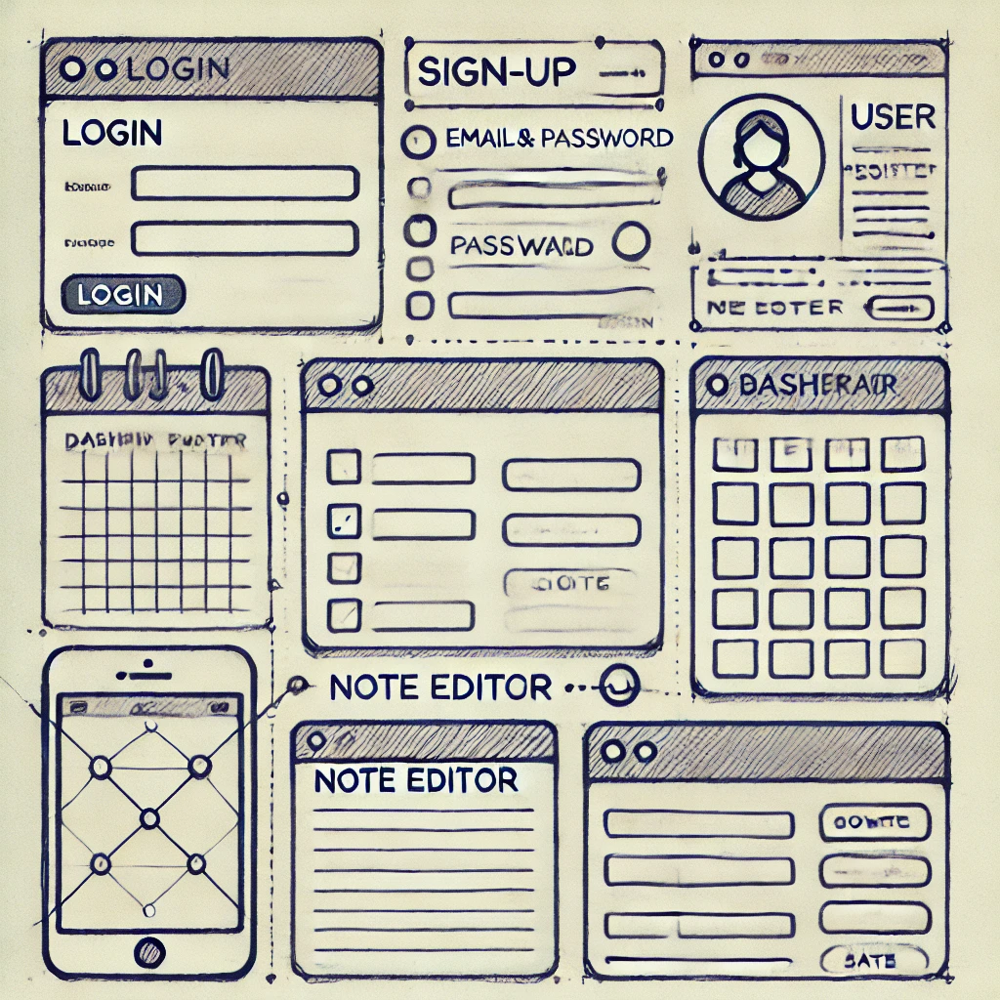

# Note_Taking_Project

## App Structure
Here's a basic outline of the app structure:

    Frontend Components:
        Login Page: To allow users to sign in.
        Sign-Up Page: To allow new users to register.
        Dashboard: A page where all user notes are listed.
        Note Editor: A form to create or edit notes.
    Backend API Endpoints:
        /auth/register: For user registration.
        /auth/login: For user login.
        /notes: For CRUD operations on notes (create, read, update, delete).

Here's the basic wireframe of the app:

